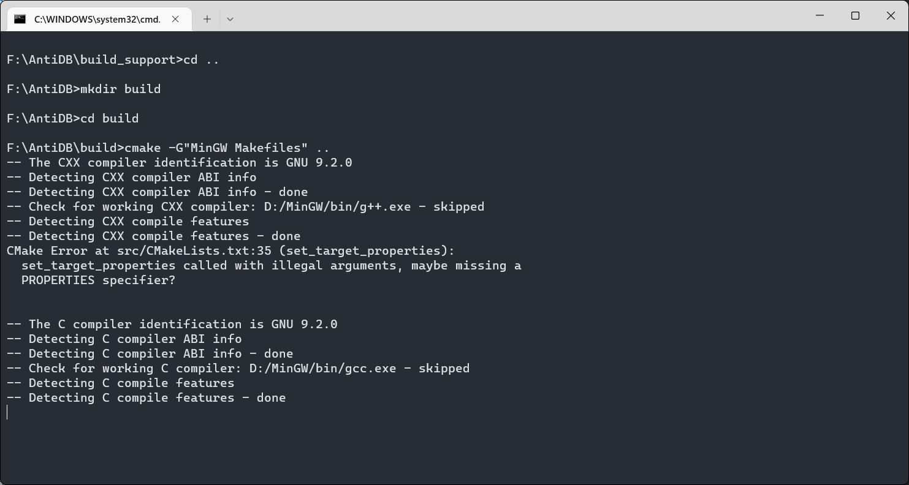
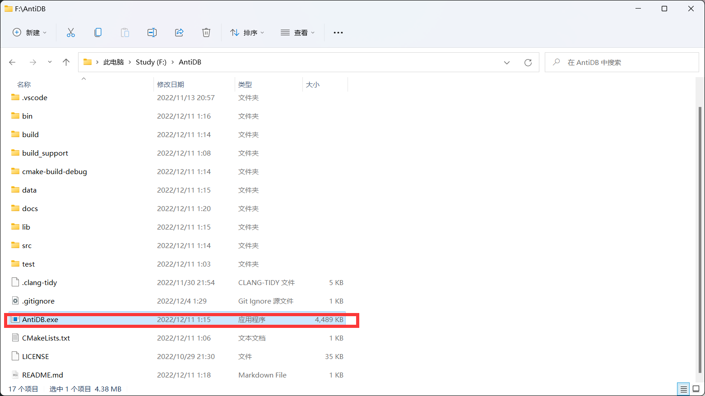
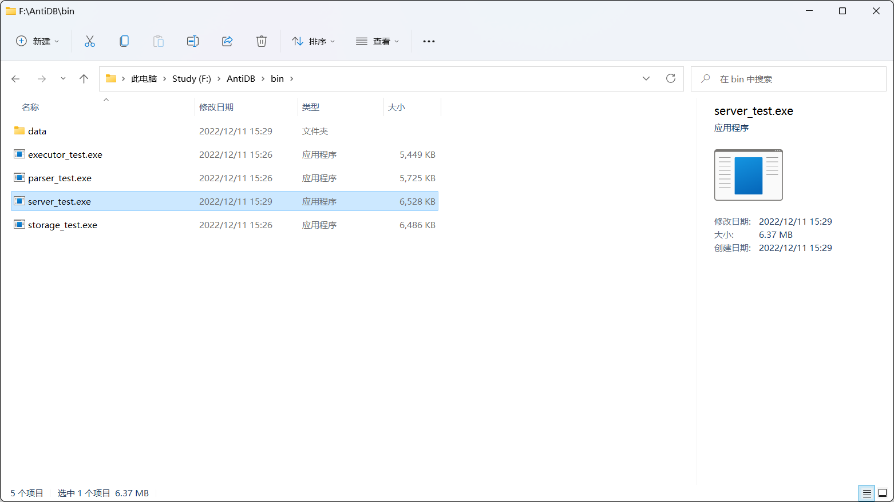
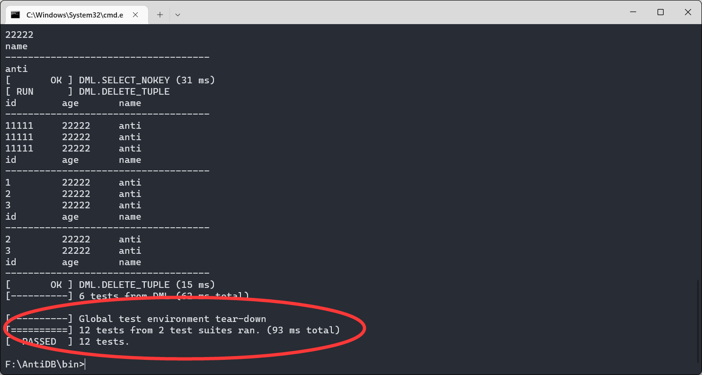
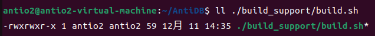
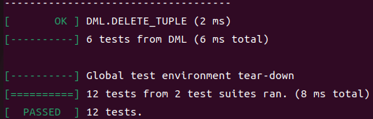

# 配置文档

- 该文档帮助你快速安装AntiDB。
- 请先根据你的操作系统选择对应的安装方式

## 获取源码

- 通过`git clone git@github.com:AntiO2/AntiDB.git`拉取源码
-

## Windows

### 环境配置

|   工具   |                  版本                   |
| :------: | :-------------------------------------: |
| 构建工具 | cmake version 3.24.3<br/>GNU Make 4.2.1 |
|  编译器  |         gcc version 9.2.0 (GCC)         |
| 版本控制 |      git version 2.34.1.windows.1       |
| 系统版本| Win11|

### 构建方式

#### 手动构建

1. 打开终端，切换工作目录为`AntiDB`
2. 如果没有`build`文件夹，输入`mkdir build`
3. `cd build`，进入build文件夹
4. `cmake -G"MinGW Makefiles" ..` 之后，`make`生成目标程序和测试程序

#### 自动构建脚本

- 在源码目录中的`build_support`文件夹中，双击运行`build.bat`,开始构建，如下图所示

- 


- 完成构建后，你就能在源码目录看见可执行文件`AntiDB.exe`啦

  

### 检查系统是否构建成功

- 完成构建后,在源码目录下的`bin`目录中,存在测试程序`server_test.exe`,如图所示
- 使用终端运行该程序(直接点击会因为退出而无法看到结果).出现下图结果说明构建成功
- 点击源码目录下的`AntiDB.exe`即可启动数据库

## Linux

### 环境配置

| 工具     | 版本                                      |
| -------- | ----------------------------------------- |
| 系统     | Ubuntu 22.04 LTS                          |
| 编译器   | g++ (Ubuntu 11.3.0-1ubuntu1~22.04) 11.3.0 |
| 构建工具 | cmake version 3.22.1<br />GNU Make 4.3    |
| 版本控制 | git version 2.34.1                        |

- 其中，`CMake`版本至少为`3.10`,请自行安装或者升级到对应或更高版本

### 构建方式

#### 手动构建

1. 首先进入源码目录中

2. ```bash
   mkdir build
   cd build
   cmake ..
   make -j2
   ```

#### 自动构建脚本

1. 检查`./build_support/build.sh`的权限。输入`ll ./build_support/build.sh `
   指令，确保脚本拥有执行权限
2. 输入`./build_support/build.sh`,开始自动构建

### 检查是否构建成功

- 按照上述步骤构建完成后，在`bin`目录下出现测试程序，输入`./bin/server_test `
  运行，如果全部Pass说明构建已经成功
- 在源码目录下出现可执行文件`AntiDB`,使用`./AntiDB`启动程序

