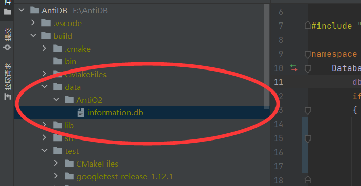

## 任务

- DDL
    - [x] create db
    - [x] drop db
    - [x] drop table
    - [x] use db
    - [x] create db

- DML
    - [x] select
        - [x] 条件判断
        - [x] projection
    - [x] delete
    - [x] insert
        - [x] insert入空表
        - [x] insert入恢复后的表
        - [x] insert入经过删除操作后的表

- DEBUG
    - [x] drop解析

- 优化
    - [ ] 加入buffer pool

    - [ ] 加入更多类型支持

    - [ ] b+树范围删除

    - [ ] 解析器优化
        - [ ] 支持大写
        - [ ] 支持多个条件判断
        - [ ] 看下能不能在网上找个分词器，自己写的有点拉跨

    - [ ] 事务支持

## 类设计

- 表由页组成
    - 一页4096B=4KB
    - 一个表设计为1024页，=4MB
    - 页用于存放tuple
  - 数据文件格式为`.dat`

- 需要另外一个文件用于存放schema信息
  - 格式为`.inf`

- 方法
  - WriteTuple 传入tuple，写入表中
  - ReadTuple 读出指定tid的tuple
  - LocateTuple 传入tid,返回写入表位置

- 属性
  - schema_    创建表的信息

  - table_name_ 表名字

  - pages[]     内存中的数据

  - ```
	  uint32_t cnt_tuple_{0};//已经存放的tuple数目
	  uint32_t tuple_per_page_;//每页存放tuple数目
	  uint32_t tuple_max_num_;//最多tuple数目
	  ```

### Tuple

- Tuple元组用于存放一排的数据

- ```
  Tuple(std::vector<Value> &values, Schema &schema)
  
  传入一组值和schema,将values序列化为一长串字节,方便之后写入
  ```

- `write(dst)`将当前数据写入指定位置

- `read(src)`从src读入到tuple之中

- `void deserialize(std::vector<Value> &values, Schema &schema)`读出当前元组的数据,存到vs中

### Value

- value用于存放单个数值
- 目前有两个构造器
  - 一个用于存放int,另外一个是string
- `GetValue(char *data)`方法将当前value以字节的形式写入到指定的`data`位置

### Column

- column用于存放一列的元信息

- | 属性            | 说明                         |
    | --------------- | ---------------------------- |
  | TYPE_ID type_   | 当前列的类型,值为INT或STRING |
  | string col_name | 当前列名                     |
  | is_primary_     | 当前列是否为主键             |
  | col_size_       | 当前列的大小                 |

- 本数据库规定：不能使用string作为主键，并且主键不能重复

### Database

- 这个类用来存放数据库的元信息，包括表名

- 元数据保存在`infomation.db`中

- 创建db，包含有表名的set,和表名-表的map

    - map中存放表的指针，在db析构时释放

- 创建

  - 通过下面指令就能简单创建一个数据库

  - ```C++
    CreateExecutor::CreateDataBase("AntiO2")
    ```

- 使用

  - 这个指令可以将当前使用的数据库切换到”AntiO2“，返回类型为一个Unique_ptr

  - ```C++
    auto db = UseExecutor::UseDataBase("AntiO2");
    ```

  - 

### Page

- Page是4096Byte大小的一串空间
- 在本项目中，目前tuple都采用定长记录的形式存储。所以给定一个tuple的id（称为RID或者TID），一定可以算出指定的offset值
- 那么删除tuple后怎么找到对应的offset值呢。我选择在table中维护一个set，这个set记录了空闲的TID，Table在插入一个tuple时，可以选择两个位置
    - 如果有空闲的位置，则给当前tuple分配空闲的tid
    - 如果没有，则分配最后一个位置
- 在table析构时，将空闲tid输出到对应info中

### Condition

- 比较函数封装为一个Condition类，通过condition_is_true 比较封装好的Value类是否满足条件
- (后改)因为不会写解析器，改成了只能比较int类型，如果比较string就会报错

## 文件格式

- .info
    - 表的元信息
    - <<schema<<cnt_tuple<<spare_tuple_

## 指令执行流程

### create table流程

- 创建对应`stmt`
- `Parser::parse_sql`  解析 ->转进`Parser::parse_create`, 返回带有schema信息的`c_stmt`
    - schema中包含列信息，与表名
- 将`c_stmt`和`db_name`传进`c_executor`中,创建一个表

### drop table

- 需要参数：table name和database
- 删除database 中的table

### drop database

- 如果当前正在使用该db，AntiDB不允许这种行为！！！
- 删除文件夹

### insert

- 这步需要将字符串转化为我们需要的tuple值

- 然后插入到指定表中

## 测试

### Storage

#### page读写测试

- 创建`table`

    ```C++
    std::string sql = "create table anti_table(id int,age int,name string);";
    auto stmt = Statement(sql);
    auto c_stmt = (Create_Statement *) Parser::parse_sql(stmt);
    EXPECT_EQ(c_stmt->name_, "anti_table");
    EXPECT_EQ(c_stmt->schema_.GetSize(), 264);
    auto table = Table(c_stmt->schema_);
   ```

- 创建测试tuple

  ```C++
  std::vector<Value> v;
  v.emplace_back(INT, 2003);
  v.emplace_back(INT, 814);
  char str[] = "AntiO2";
  v.emplace_back(STRING, str, strlen(str));
  auto t = Tuple(v, c_stmt->schema_);
  ```

- 读写页

  ```c++
  for (auto i = 0; i < 100; i++) {
  table.WriteTuple(t);
  }
  for (auto i = 0; i < 10; i++) {
  auto new_t = Tuple(c_stmt->schema_.GetSize());
  table.ReadTuple(new_t, i);
  std::vector<Value> vs;
  new_t.deserialize(vs, c_stmt->schema_);
  EXPECT_EQ(vs[0].GetInt(), 2003);
  EXPECT_EQ(vs[1].GetInt(), 814);
  std::cout<<strlen(vs[2].GetSTRING())<<" "<<vs[2].GetSTRING()		<<std::endl;
  }
  ```

### Server测试

- DDL

| 测试项目   | 测试结果 |
| ---------- | -------- |
| 创建数据库 | √        |
| 使用数据库 | √        |
| 删除数据库 | √        |
| 创建表     | √        |
| 删除表     | √        |

- DML

| 测试项目              | 测试结果 |
| --------------------- | -------- |
| insert数据 （无主键） | √        |
| insert数据 （含主键） | √        |
| select all            | √        |
| select and projection | √        |
| delete by condition   | √        |
| delete all            | √        |
